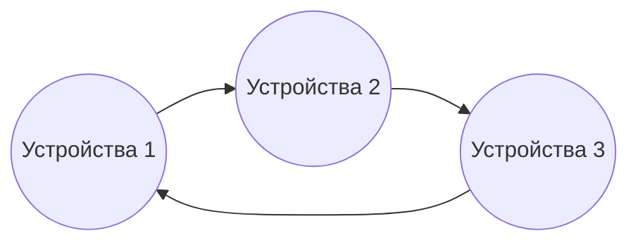
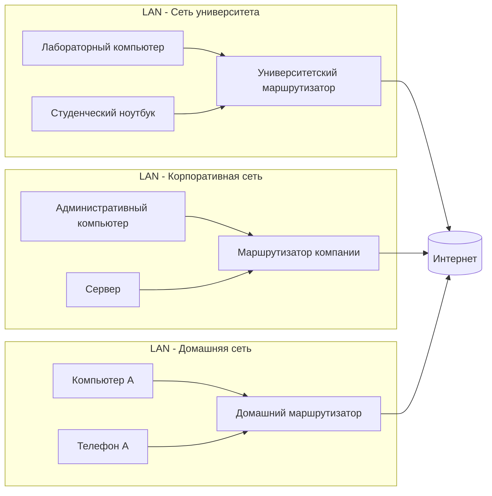

> Простое теоретическое введение в основные концепции сетей и Интернета для первокурсников и тех, кто начинает работать в сфере ИТ.

## Что такое сеть?

**Сеть**, в простейшем определении, представляет собой структуру, которая позволяет двум или более устройствам (компьютерам, принтерам, телефонам, серверам, аndroid-ТВ и т. д.) обмениваться данными друг с другом.

После создания сети устройства могут обмениваться информацией, файлами, ресурсами и услугами. Такое совместное использование может осуществляться с помощью **проводных** (например, Ethernet) или **беспроводных** (например, Wi-Fi) средств.

### Основные свойства сетей

- **Подключение:** Необходимо подключить не менее двух устройств.
- **Передача данных:** Пакеты данных передаются между устройствами, подключенными к сети.
- **Протоколы:** Набор правил, которые позволяют устройствам «говорить на одном языке» (например, TCP/IP).
- **Топология:** Физическое или логическое расположение устройств в сети (например, топология «звезда», «кольцо», «сетка»).

### Типы сетей

| Тип | Описание |
|-----|----------|
| **LAN** (Local Area Network) | Объединяет устройства в одном офисе, здании или доме. |
| **MAN** (Metropolitan Area Network) | Соединение сетей внутри города. |
| **WAN** (Wide Area Network) | Это совокупность сетей, охватывающих очень большую географическую территорию. Интернет также является глобальной сетью. |

## Что такое интернет?

**Интернет**, это гигантская **сеть сетей**(*network of networks*), образованная путем объединения миллионов сетей по всему миру.

Эта система, впервые разработанная в 1960-х годах Министерством обороны США под названием **ARPANET** `(см. также: ОГАС)`, постепенно достигла своей нынешней универсальной структуры, охватывающей университеты, исследовательские центры и государственные учреждения.

Интернет имеет децентрализованную структуру. Каждая сеть работает независимо; но могут взаимодействовать друг с другом, используя стандартные протоколы (например, TCP/IP).

### Основные компоненты Интернета

- **IP-адрес:** это уникальный идентификатор каждого устройства в Интернете.
- **DNS (система доменных имен):** — это система, которая преобразует доменные имена в IP-адреса.
- **Маршрутизатор:** обеспечивает доставку данных по назначению.
- **Серверы**: это компьютеры, на которых размещается контент, такой как веб-сайты и службы электронной почты.

## Разница между сетью и Интернетом

| Особенность              | Сеть (Network)                                   | Интернет                                          |
|----------------------|------------------------------------------------|--------------------------------------------------|
| **Определение**             | Структура передачи данных между устройствами           | Объединение всех сетей мира            |
| **Область применения**            | Это может быть небольшой масштаб                        | Глобальный                                           |
| **Право собственности**          | Это может быть отдельное лицо или учреждение            | Децентрализованный, многопоставщикный      |
| **Доступ**            | Ограниченное или специальное предложение                            | В целом открыто для публики                        |

## Значение в повседневной жизни

Я хочу, чтобы вы задумались о количестве сетей и устройств в Интернете сегодня, а также о концепции «Интернета вещей (IoT)». Это очень много устройств. Это подводит нас к концепции IPv4 и v6. Ну, конечно, прежде всего мы подробно рассмотрим концепцию Интернета.

## Заключение

Сети и интернет — это не просто технологические системы, это **спина** цифровой эпохи. Понимание этих структур — первый шаг к тому, чтобы стать не просто пользователем, но и тем, кто их разрабатывает (или взламывает).

> 🎓 **Примечание:** Эта тема составляет основу многих курсов, которые вы будете изучать позже, таких как передача данных, кибербезопасность, серверные системы и разработка программного обеспечения.

---

**Вы готовы?** В следующем разделе мы рассмотрим с вами сетевую архитектуру, уровни протоколов и принципы работы пакетов данных. Следите за обновлениями!

